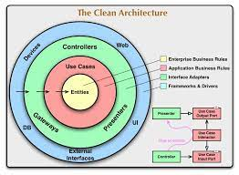

# Spacexdata.API.V4.Integration.ApiGateway

## About
This project is a Gateway REST API built using .NET 7 and follows the principles of Clean Architecture introduced by by [Robert C. Martin (Uncle Bob)](https://blog.cleancoder.com/uncle-bob/2012/08/13/the-clean-architecture.html). The API Gateway serves as an entry point to various backend services which is in fact [SpaceX REST API V4](https://api.spacexdata.com/latest) in order to provide a unified API for client applications. The project implements a modular and decoupled architecture, allowing for easy maintenance, scalability, and testability.

## Clean Architecture Overview

    

Clean Architecture is a software design pattern that promotes separation of concerns and maintainability. It emphasizes building applications with distinct layers, each with its own responsibilities and dependencies. The core principles of Clean Architecture include:

1. **Independence of Frameworks**: The inner layers of the application are not affected by changes in external frameworks, making it easier to update or replace them.
2. **Separation of Concerns**: The architecture is divided into layers, such as Presentation, Application, Domain, and Infrastructure, each responsible for a specific aspect of the application.
3. **Dependency Rule**: Dependencies between layers are structured to point inward, where inner layers do not know anything about outer layers.
4. **Testability**: The architecture allows for easy unit testing of the application's business logic without the need for external dependencies.

This project follows the Clean Architecture principles by organizing the codebase into the following layers:

1. **Presentation Layer**: This layer handles the HTTP requests and responses, serving as the entry point for the API. It contains the controllers, models, and view models.
2. **Application Layer**: The application layer contains the business logic and orchestrates the interactions between different components. It encapsulates use cases and defines interfaces for external dependencies.
3. **Domain Layer**: This layer represents the core of the application and contains the domain models, entities, and business rules. It is independent of any infrastructure or implementation details.
4. **Infrastructure Layer**: The infrastructure layer provides implementations for the interfaces defined in the application layer. It includes data access, external service integrations, and other infrastructure-specific concerns.

## How to Run the Web Application

### Prerequisites
- [.NET 7 SDK](https://dotnet.microsoft.com/download/dotnet/7.0)
- [Docker](https://www.docker.com/products/docker-desktop)

### Running Locally using dotnet CLI
1. Clone the repository: `git clone https://github.com/your/repository.git`
2. Navigate to the project directory: `cd project-directory`
3. Restore the project dependencies: `dotnet restore`
4. Build the project: `dotnet build`
5. Run the application: `dotnet run`

The application will start and be accessible at `http://localhost:5000` or `https://localhost:5001`.

### Running with Docker
1. Clone the repository: `git clone https://github.com/your/repository.git`
2. Navigate to the project directory: `cd project-directory`
3. Build the Docker image: `docker build -t project-name .`
4. Run the Docker container: `docker run -d -p 5000:80 project-name`

The application will start inside a Docker container and be accessible at `http://localhost:5000`.

## API Documentation
Once the application is running, you can access the API documentation at `http://localhost:5000/swagger` to explore the available endpoints and interact with the Gateway REST API.

### Warm thanks
* [Robert C. Martin (Uncle Bob) Clean Architecture Blog](https://blog.cleancoder.com/uncle-bob/2012/08/13/the-clean-architecture.html)
* [Robert C. Martin (Uncle Bob) Clean Architecture: a craftsman's guide to software structure and design (book)](https://www.amazon.es/-/pt/dp/0134494164/ref=asc_df_0134494164/?tag=ptgogshpadde-21&linkCode=df0&hvadid=633475003571&hvpos=&hvnetw=g&hvrand=377167890099432971&hvpone=&hvptwo=&hvqmt=&hvdev=c&hvdvcmdl=&hvlocint=&hvlocphy=1011759&hvtargid=pla-423658477418&psc=1)
* [Jason Taylor Clean Architecture Template](https://github.com/jasontaylordev/CleanArchitecture/tree/f19bd21075a94d0c47b3b212734aba26db9abde7)
* [Steve Smith (Ardalis) Clean Architecture Template](https://github.com/ardalis/CleanArchitecture/tree/55b9e4a2ccc319e9c6f387ed17595e4ef622d8a6)
* [Domain Events Pattern](https://lostechies.com/jimmybogard/2014/05/13/a-better-domain-events-pattern/)
* [Clean Architecture by ezzylearning](https://www.ezzylearning.net/tutorial/a-guide-for-building-software-with-clean-architecture)
* [.NET Domain Events Using MediatR](https://wrapt.dev/blog/dotnet-domain-events)
* [Anaemic Domain Model vs. Rich Domain Model](https://dev.to/crovitz/have-you-anemic-or-rich-domain-model-2ala)